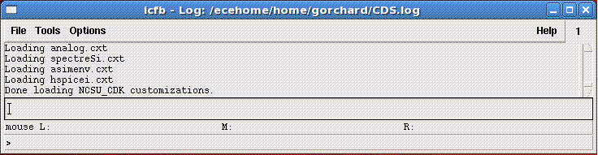

Over the past 25 years, Ralph Etienne-Cummings’ research has developed through three main phases. In the early part of his career, he studied biologically inspired sensors and sensory computation systems, primarily in the form of vision sensors. Typically, these systems were implemented with Very Large Scale Integrated (VLSI) technology and were used to extract information about the environment and to guide the “attention” of other
computation systems.
