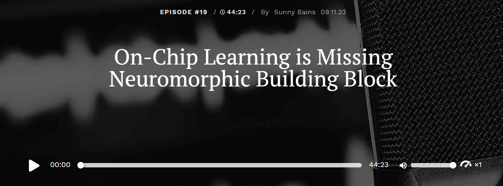

[Click here to check out this Brains and Machines episode](https://www.eetimes.com/podcasts/on-chip-learning-is-missing-neuromorphic-building-block/)

Sunny Bains from EE Times talks to Elisabetta Chicca, who leads the bio-inspired Circuits and Systems research group at the University of Groningen. They discuss creating neural chips using memristors, integrating electronic brains into neural robots, challenges with spiking system learning algorithms, and engage in a discussion with Giulia D’Angelo from the Italian Institute of Technology and Ralph Etienne-Cummings from Johns Hopkins University.
