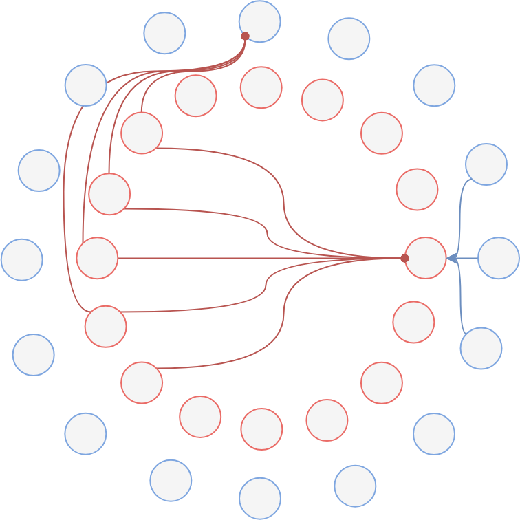

Aimed at building a biologically plausible system to reproduce the spatial encoding behavior discovered in the Hippocampus of rodents. This topic helps improve the understanding of neurological systems as well as the robotic SLAM problem. Specifically, several groups of neurons become active only when the rodent is at certain spatial locations.
Neurological models attribute such spatial encoding to neurons that react to the animal’s locomotion. We believe that navigation and tracking capabilities are achieved through interactions between these groups of neurons. This project tests and improves models of such interactions to create a navigation and tracking system inspired by neural activities.
A mixed-mode ASIC chip is designed to generate the basic neural response to locomotion. An improved model for generating spatial encoding in silicon circuit environments has been proposed. Currently, the model is being implemented with the chip and FPGA for an integrated system for path tracking and mapping.

