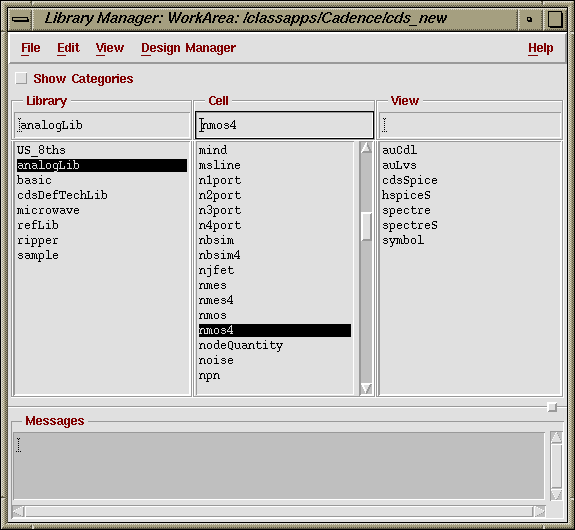

One of the simpler ways to navigate through the libraries (Both the Cadence defaults, and your own custom ones) is to use the Library Manager. A library is a collection of cells, such as NOT, AND, NAND, etc. By the end of the semester, you should have full representations of most primitive gates and a few complex cells. These cells contain several _views_, including schematic, layout, extracted, symbol, etc.

Some added conventions that will be used are as follows:

- Click **CIW:Tools -> Library Manager** – This means the following: go to the CIW window, left-click once on the Tools Menu, then left-click once on the Library Manager option in the pop-up menu that will appear.

---

## Let’s get started… click **CIW:Tools -> Library Manager**.

The Library Manager window should appear in just a few moments. This window should be similar to the one below:

The left column is a list of the current libraries. From these libraries **NCSU_Analog_Parts** is the most important. This library contains all the components used during VLSI circuit design and it will be used the most.

Left-click on **NCSU_Analog_Parts** in the library browser. Left-click on **nmos4** to display the cell views of the NMOS transistor design. You should be able to see several different cell views. The cell views contain the following information:

- _symbol_: contains the symbol representation of the schematic.
- _CdsSpice, HspiceS, Spectre, spectreS_: contain Spice simulation information for the element.

Feel free to look at any of the cell views. To do this, double-click on the particular cell view of interest. A window will open showing the contents of that particular window. In different cells, you may encounter the following cell views:

- _abstract_ – contains an abstract representation of the layout for use by Cadence place and route software.
- _extracted_ – contains layout connectivity for use by verification programs.
- _layout_ – contains the silicon-level representations of the transistors and wiring.
- _schematic_ – contains the logical design of the device.
- _behavioral_ – contains the VHDL description of the cell.

---

_Note:_

Sometimes, the window you are working in isn’t big enough to display everything inside of it. When this happens, scroll-bars appear at the bottom, or the sides to allow you to see all of it. On the other hand, you may also change the size of the window. There are several ways to do this, depending on which best suits your needs. If you double-click (left) on the title bar, the window will “explode” to fill your screen vertically, but it won't get any wider. Double-click (left) the menu bar (again) will return it to its original size.
